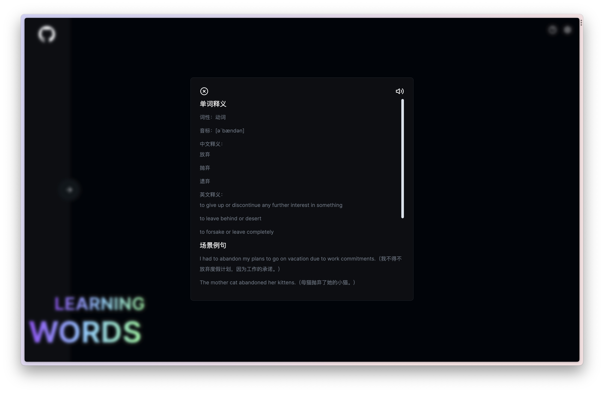

<p align="center" style="font-size: 24px; font-weight:bold">English Word Learning Book (Web)</p>
<p align="center">
<em>The product is inspired by the <a href="https://github.com/openai-translator/openai-translator">openai-translator</a> vocabulary book.</em></p>
<p align="center"><em>Prompt is inspired by <a href="https://twitter.com/vista8">vista8</a></em></p>
<p align="center"><em>Color matching comes from <a href="https://github.com/features/preview/copilot-x">Copilot X</a></em></p>

<p align="center">
 
 
 

</p>

<p align="center"> 
English | <a href="README_CN.md">中文</a>
</p>

## Screenshot



## Features

1. Browser local data storage (pure front-end function, no back-end service, except for translation using OpenAI API)
2. Support exporting collected word books (in CSV format)
3. Word learning includes multiple scenarios: `word definition`, `scenario example sentences`, `similar words`, `English stories`, `quizzes and answers`.

## Preparation

-   (Mandatory) Apply for an [OpenAI API Key](https://platform.openai.com/account/api-keys)
-   (Optional) If you cannot access `OpenAI`, you can use the `OpenAI API Proxy`.
-   (Note) The [help center](https://imcai.notion.site/Learning-Words-211888d2bd1b4c2d9ae964e486691e33?pvs=4) provides related video tutorials.

## Installation

```bash
# Install dependencies
pnpm install

# Start development environment
pnpm dev
```

The local development runs on port `3012`. If you want to modify it, you can go to `package.json` and change the dev command.

```json
{
    "scripts": {
        "dev": "next dev -p [port]"
    }
}
```

## Additional Configuration

-   If you need to use [Umami](https://github.com/umami-software/umami)，you need to configure environment variables.

```bash
ANALYZE_WEBSITE_URL= URL address

DATA_WEBSITE_ID= URL statistics ID
```

-   If not needed，delete the following related code in `layout.tsx`

```typescript jsx
<script async src={process.env.ANALYZE_WEBSITE_URL} data-website-id={process.env.DATA_WEBSITE_ID}></script>
```

## License

[LICENSE](./LICENSE)

## Group

<a target="_blank" href="https://t.me/+6Rm32SFK9VdiMjM1">Join our Telegram group</a>

<p></p>

