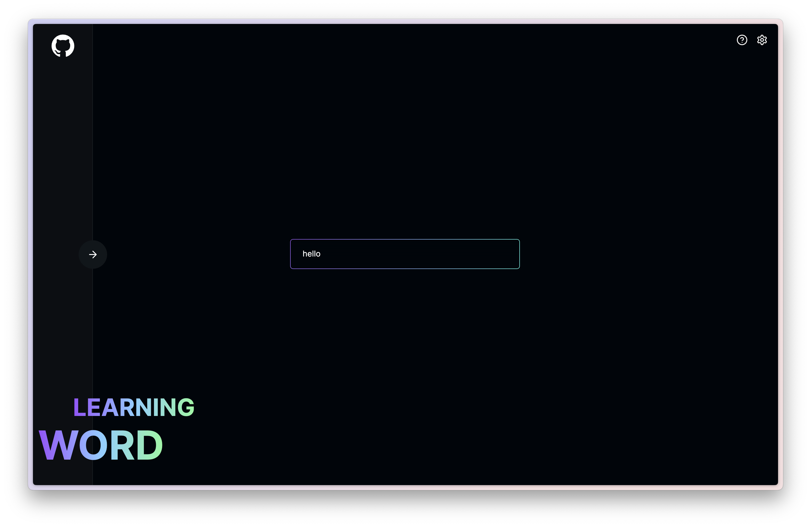

<p align="center" style="font-size: 24px; font-weight:bold">英文单词学习本(WEB)</p>
<p align="center">
<em>产品灵感来源于 <a href="https://github.com/openai-translator/openai-translator">openai-translator</a> 生词本</em></p>
<p align="center"><em>Prompt 灵感来源于 <a href="https://twitter.com/vista8">vista8</a></em></p>
<p align="center"><em>配色来源于 <a href="https://github.com/features/preview/copilot-x">Copilot X</a></em></p>

<p align="center">
 
 
 
</p>

<p align="center"> 
<a href="README.md">English</a> | 中文
</p>

## 截图



## 特性

1. 浏览器本地数据保存（纯前端功能，无后端服务，除了翻译走 OpenAI API）
2. 支持导出收集的单词本（CSV 格式）
3. 单词学习包含多个场景 `单词释义` `场景例句` `相似词` `英文故事` `小测验及答案`

## 使用准备

-   （必须）申请 [OpenAI API Key](https://platform.openai.com/account/api-keys)
-   （可选）如果无法访问 `OpenAI`，可以使用 `OpenAI API Proxy`
-   （备注）[帮助中心](https://imcai.notion.site/Learning-Words-211888d2bd1b4c2d9ae964e486691e33?pvs=4) 提供了相关视频教程

## 安装

```bash
# 安装依赖
pnpm install

# 启动开发环境
pnpm dev
```

本地开发运行在 `3012` 端口，想要修改的可以去 `package.json` 中更改 `dev` 命令

```json
{
    "scripts": {
        "dev": "next dev -p [port]"
    }
}
```

## 额外的配制

-   如果你需要用到 [Umami](https://github.com/umami-software/umami)，需要配制环境变量

```bash
ANALYZE_WEBSITE_URL= URL 地址

DATA_WEBSITE_ID= URL 统计ID
```

-   如果你不需要，可以在 `layout.tsx` 中删除以下相关代码

```typescript jsx
<script async src={process.env.ANALYZE_WEBSITE_URL} data-website-id={process.env.DATA_WEBSITE_ID}></script>
```

## License

[LICENSE](./LICENSE)

## 群组

<a target="_blank" href="https://t.me/+6Rm32SFK9VdiMjM1">加入 Telegram 群组</a>

<p></p>

